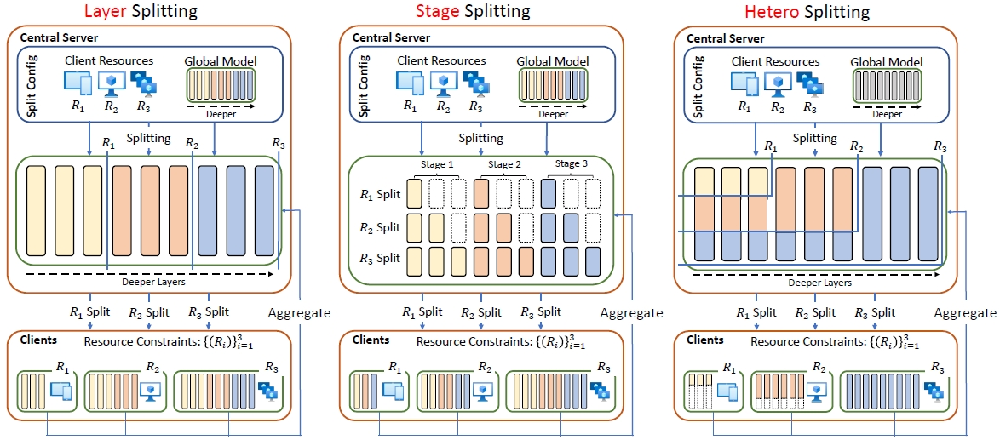
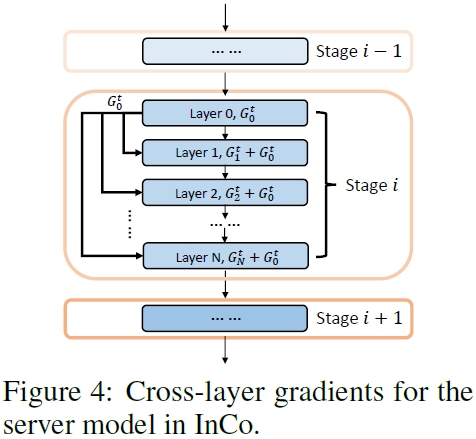
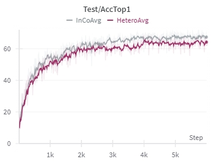
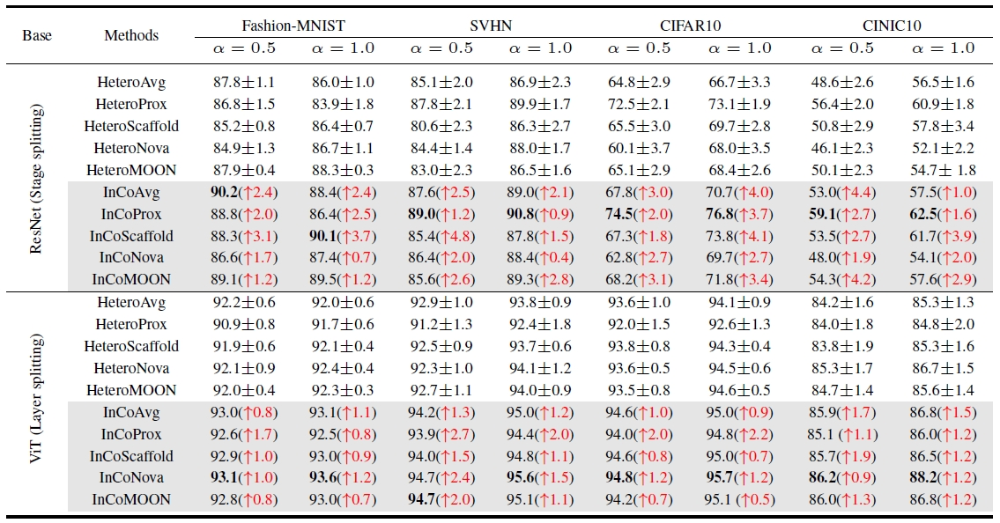

# Internal Cross-layer Gradients for Extending Homogeneity to Heterogeneity in Federated Learning

 This repository is the official implementation of [Internal Cross-layer Gradients for Extending Homogeneity to Heterogeneity in Federated Learning (ICLR 2024)](https://openreview.net/forum?id=Cc0qk6r4Nd). 


<div align="center">
  
</div>


## Abstract

Federated learning (FL) inevitably confronts the challenge of system heterogeneity in practical scenarios. To enhance the capabilities of most model-homogeneous FL methods in handling system heterogeneity, we propose a training scheme that can extend their capabilities to cope with this challenge. In this paper, we commence our study with a detailed exploration of homogeneous and heterogeneous FL settings and discover three key observations: (1) a positive correlation between client performance and layer similarities, (2) higher similarities in the shallow layers in contrast to the deep layers, and (3) the smoother gradients distributions indicate the higher layer similarities. Building upon these observations, we propose InCo Aggregation that leverages internal cross-layer gradients, a mixture of gradients from shallow and deep layers within a server model, to augment the similarity in the deep layers without requiring additional communication between clients. Furthermore, our methods can be tailored to accommodate model-homogeneous FL methods such as FedAvg, FedProx, FedNova, Scaffold, and MOON, to expand their capabilities to handle the system heterogeneity. Copious experimental results validate the effectiveness of InCo Aggregation, spotlighting internal cross-layer gradients as a promising avenue to enhance the performance in heterogeneous FL.


<div align="center">
  
</div>

## Requirements

To install requirements:

```setup
pip install -r requirements.txt
```

> The main packages used in this project are: torch==1.13.0, torchvision==0.14.0, timm==0.6.11

## Training and Evaluation

#### ResNet (Stage Splitting)
To train and evaluate the InCo Aggregation for HeteroAvg on CIFAR10 in the paper, run this command:

```train
cd fed_experiments
cd InCo

python main.py \
--dataset cifar10 \ # cinic10, FashionMNIST, SVHN
--data_dir "<Path of Dataset>" \
--partition_method hetero-fixed \ # hetero-fixed, hetero, homo
--client_number 100 \
--comm_round 500 \
--epochs_client 5 \
--client_sample_ratio 0.1 \
--batch_size 64 \
--lr 0.001 \
--running_name InCoAvg_resnet_cifar10 \
--InCo_training 1 \ # 1 is using InCo Aggregation, 0 is HeteroAvg
--partition_alpha 0.5 \ # The level of Non-IID: a smaller value indicates a higher degree of Non-IID
--gpu_starting_point 0 \
--gpu_num_per_server 4 # Multiprocessing on 4 GPUs
```

#### ViT (Layer Splitting)
To train and evaluate the InCo Aggregation for HeteroAvg on CIFAR10 in the paper, run this command:

```train
cd fed_experiments
cd InCo

python main.py \
--dataset cifar10 \ # cinic10, FashionMNIST, SVHN
--data_dir "<Path of Dataset>" \
--partition_method hetero-fixed \ # hetero-fixed, hetero, homo
--client_number 100 \
--comm_round 500 \
--epochs_client 5 \
--client_sample_ratio 0.1 \
--batch_size 32 \
--lr 0.01 \
--optimizer SGD \
--running_name InCoAvg_vit_cifar10 \
--InCo_training 1 \ # 1 is using InCo Aggregation, 0 is HeteroAvg
--partition_alpha 0.5 \ # The level of Non-IID: a smaller value indicates a higher degree of Non-IID
--gpu_starting_point 0 \
--gpu_num_per_server 4 \ # Multiprocessing on 4 GPUs
--vit # add this flag to use ViT 
```

#### ResNet (Hetero Splitting)

> For Hetero Splitting, please refer to the source codes from HeteroFL https://github.com/diaoenmao/HeteroFL-Computation-and-Communication-Efficient-Federated-Learning-for-Heterogeneous-Clients

> Adapt the function called "aggregate_IN_gradients" in utils.py to the source code of HeteroFL to obtain the results from HeteroFL + InCo, as well as for FedRolex and ScaleFL.

> Source codes from ScaleFL and FedRolex: https://github.com/blockchain-systems/ScaleSFL and https://github.com/AIoT-MLSys-Lab/FedRolex


## Results

Our model achieves the following performance on the Avg-based method (ResNet with stage splitting):




More results




## Contributing

For the baselines called FedProx, Scaffold, FedNova, and MOON, please refer to the source codes from https://github.com/Xtra-Computing/NIID-Bench

For the baselines from FL of system heterogeneous, please refer to the source codes from HeteroFL: https://github.com/diaoenmao/HeteroFL-Computation-and-Communication-Efficient-Federated-Learning-for-Heterogeneous-Clients, ScaleFL: https://github.com/blockchain-systems/ScaleSFL, and FedRolex: https://github.com/AIoT-MLSys-Lab/FedRolex .

Thanks for their codes!

## Citation

If you find the paper provides some insights or our code useful, please consider giving a star ⭐ and citing:

```
@inproceedings{
    chan2024internal,
    title={Internal Cross-layer Gradients for Extending Homogeneity to Heterogeneity in Federated Learning},
    author={Yun-Hin Chan and Rui Zhou and Running Zhao and Zhihan JIANG and Edith C. H. Ngai},
    booktitle={The Twelfth International Conference on Learning Representations},
    year={2024},
    url={https://openreview.net/forum?id=Cc0qk6r4Nd}
}
```
